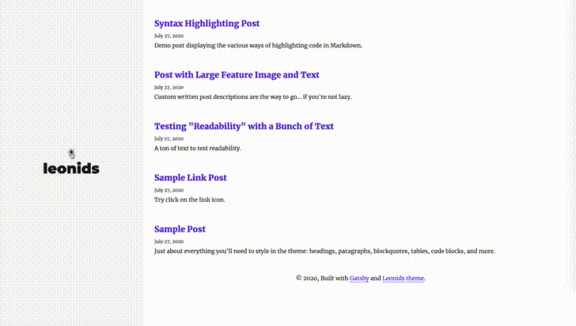
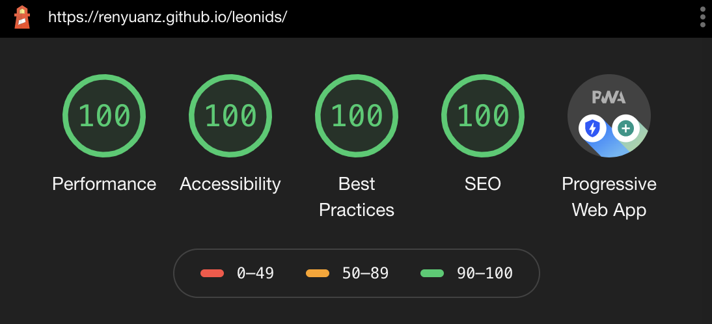

# Leonids Gatsby starter

**[Leonids](http://renyuanz.github.io/leonids)** is a clean, fixed sidebar Gatsby starter which is perfect for powering your GitHub hosted blog.

### Preview



## What is Leonids?

A blazing fast static blog theme built on Gatsby.js



- Responsive templates. Looking good on any viewport.
- Fixed sidebar to provide a good navigation experience while reading.
- Light/Dark mode.
- **And** the Leonids (/ˈliːənɪdz/ lee-ə-nidz) are a prolific meteor shower associated with the comet [Tempel-Tuttle](https://en.wikipedia.org/wiki/55P/Tempel%E2%80%93Tuttle).

See a [demo](http://renyuanz.github.io/leonids/) hosted on GitHub pages.


## Getting Started (Recommended)

### One click deploy to Netlify CMS

Netlify CMS can run in any frontend web environment, but the quickest way to try it out is by running it on a pre-configured starter site with Netlify. Use the button below to build and deploy your own copy of the repository:

<a href="https://app.netlify.com/start/deploy?repository=https://github.com/renyuanz/leonids&amp;stack=cms"></a>

After clicking that button, you’ll authenticate with GitHub and choose a repository name. Netlify will then automatically create a repository in your GitHub account with a copy of the files from the template. Next, it will build and deploy the new site on Netlify, bringing you to the site dashboard when the build is complete. Next, you’ll need to set up Netlify’s Identity service to authorize users to log in to the CMS.

### Local development setup

```
gatsby new my-blog https://github.com/renyuanz/leonids
cd my-blog
gatsby develop
```

Check out your awesome blog at `http://localhost:8000` and Cheers!


## Legacy Jekyll theme

This project was a Jekyll blog theme, which is archived and not maintained any more. You can still find the source code in [leonids-jekyll](https://github.com/renyuanz/leonids/tree/leonids-jekyll) branch.
